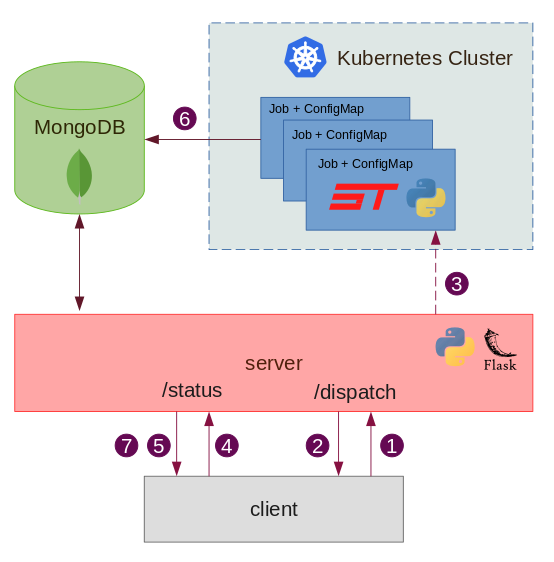

# ShnooTalk Cloud Compile

Backend and infrastructure to compile and execute [ShnooTalk](https://github.com/RainingComputers/ShnooTalk) programs on the cloud.
Primary use case is for users to try the language in the browser. (See [ShnooTalk Playground](https://github.com/RainingComputers/shnootalk-playground/))

The project is made up of two sub-projects, the job and the server. The server
has endpoints to dispatch programs (start compile and run jobs on a kubernetes cluster)
and query status of execution. The job does the actual compilation and execution.

Both the server and the job use MongoDB to keep track of the execution status.

To deploy Cloud Compile on a kubernetes cluster, follow [these instructions](deploy/x86_64) or follow [k3s raspberry pi instructions](deploy/RaspberryPi)

## Architecture



1. Client make a POST request to /dispatch endpoint with the programs
2. Server creates a status=SCHEDULED entry in MongoDB and return back an ID (generated by Mongo) for reference
3. Server spawns a Kubernetes Job with the programs attached as a ConfigMap, passing the ID as a CLI argument to the Job
4. The client continuously polls the /status/id endpoint
5. Server responds to with the status of the program, reading from MongoDB
6. The Job has a python script that invokes the ShnooTalk compiler (compile) and the Clang Compiler (link), executes the output executable, and writes the status and output to MongoDB. (Uses ID passed in step 3)
7. The client gets a terminal execution status and the output, stops polling the server. Terminal status executions are SUCCESS, EXEC_TIMEDOUT, CLANG_LINK_TIMEDOUT, CLANG_LINK_FAILED COMPILE_FAILED, COMPILE_TIMEDOUT. The Job also writes a non terminal status COMPILE_STARTED before compilation in step 6.

## Running on local for development

+ Install [K3D](https://k3d.io/v4.4.8/) or [Minikube](https://minikube.sigs.k8s.io/docs/start/)
+ Create a kubernetes cluster
+ Find out your LAN IP address using `ifconfig` or `ipconfig`
+ Deploy the following secret
```yaml
apiVersion: v1
kind: Secret
metadata:
  name: shnootalk-cloud-compile-mongodb-url
type: Opaque
stringData:
  connectionString: mongodb://root:example@<YOUR-LAN-IP>:27017
```
+ Start MongoDB

```
docker-compose -f server/test-services.yml up
```
+ Start server
```
cd server
pipenv shell
pipenv install --dev
KUBE_CONTEXT=<YOUR-CLUSTER> COMPILE_JOB_NAMESPACE=default make rundev
```
+ Dispatch a program by making a POST request
```
curl --header "Content-Type: application/json" \
  --request POST \
  --data '{"main.shtk": "fn main() -> int { println(\"Hello world\") return 0 }"}' \
  http://127.0.0.1:5000/shnootalk/compile/api/v1/dispatch
```
+ You will get back a response with reference id
```
{"_id":"61533f96d541934ade6525d1"}
```
+ Track execution status by watching the status endpoint
```
watch 'curl -s --request GET http://127.0.0.1:5000/shnootalk/compile/api/v1/status/61533f96d541934ade6525d1'
```
+ You will get back status response
```
{"_id":"61533f96d541934ade6525d1","status":"SCHEDULED"}
```
+ Once the execution is complete, you will get this response
```
{"_id":"61533f96d541934ade6525d1","output":"Hello world\n","status":"SUCCESS"}
```

## Env variables


### Server env variables

| Name                   | Description    
|------------------------|-------------
| USE_INCLUSTER_CONFIG   | `"true"` or `"false"`. If server is deployed in a kubernetes cluster, setting this to `"true"` will tell the server to deploy jobs in the cluster it is running in.
| KUBE_CONTEXT           | Only applicable if USE_INCLUSTER_CONFIG is set to `"false"`. It will get cluster details from kubernetes context available on the machine it is running in.
| COMPILE_JOB_NAMESPACE  | The namespace in which compile jobs will be deployed.
| MONGO_URL              | MongoDB connection string 
| MONGO_DATABASE         | Name of the database to use
| MONGO_COLLECTION       | Name of the collection to use
| MONGO_URL_SECRET_NAME  | Name of the secret in which MongoDB connection string is present. This secret will be used by jobs to connect to the database, and should be deployed in COMPILE_JOB_NAMESPACE
| MONGO_URL_SECRET_KEY   | The key in which the connection string is present in the above secret MONGO_URL_SECRET_NAME
| JOB_TIMEOUT            | Sets TIMEOUT env variable on the Job
| HEARTBEAT_JOB_ENABLE   | Spawns a compile job every HEARTBEAT_JOB_INTERVAL seconds to keep GKE autopilot on its toes, so jobs doesn't stay pending for too long. Set to either `"true"` or `"false"`.
| HEARTBEAT_JOB_INTERVAL | Time between heartbeat jobs in seconds
| JOB_IMAGE              | Docker image for the job, default is `docker.io/shnoo28/shnootalk-cloud-compile-job:0.2.3`

### Job env variables (controlled by server)

| Name              | Description 
|-------------------|-------------
| TIMEOUT           | Timeout for program execution and compilation (both separately)
| MONGO_URL         | MongoDB connection string 
| MONGO_DATABASE    | Name of the database to use
| MONGO_COLLECTION  | Name of the collection to use
| HEARTBEAT         | Will not write to MongoDB if set to `'true'`


## ShnooTalk Playground UI

Run and try the [ShnooTalk](https://github.com/RainingComputers/ShnooTalk) language from your browser!

Web code editor for ShnooTalk Cloud Compile based on [shnootalk-ace](https://github.com/RainingComputers/shnootalk-ace/pulse)
(extended [ace](https://github.com/ajaxorg/ace) text editor with ShnooTalk syntax support).

**Configuration**

Change `SERVER_URL` in `compile.js` to point to cloud compile.
